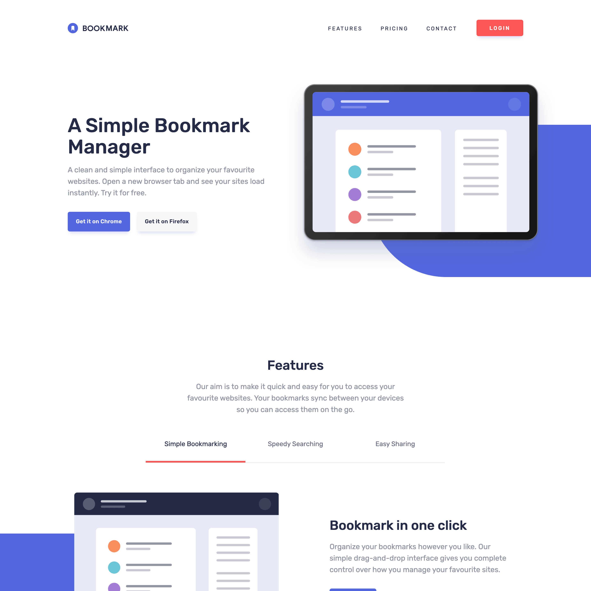

# Bookmark

A landing page for a fictional bookmark manager extension

## Hi ! 👋

**Thanks for checking out this [project](https://davidyvon.github.io/bookmark-landing-page/) !**

## General info

- Mobile first responsive design
- Mobile menu
- Toggle tabs
- Collapsible panel
- Form input with data validation

## Built with

      

## Want to see more ?

**Check out my [portfolio](https://www.davidyvon.com) !**
